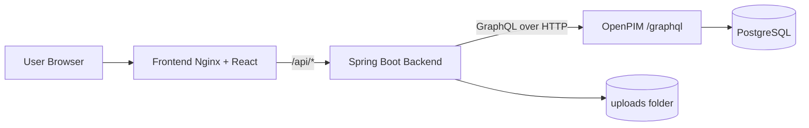

# Code and Architecture Guide

## 1. Purpose of This Document

This guide is the single source of truth for engineers working in this workspace.
Its goals are:
- shorten onboarding time;
- explain how frontend and backend cooperate;
- document API contracts precisely;
- make extension/refactoring safer;
- provide implementation-level details, not only high-level concepts.

This document focuses on the application code.
For operations and infrastructure runbooks, see `docs/DEPLOYMENT_GUIDE.md`.
For detailed workbook contract and import validation matrix, see `docs/EXCEL_IMPORT_GUIDE.md`.

---

## 2. System Overview

The workspace contains a 4-service stack:
- `frontend` (`pim-frontend`): React UI served by Nginx;
- `backend` (`pim-backend`): Spring Boot API that exposes file upload, GraphQL explorer, and Excel import execution endpoints;
- `openpim`: external OpenPIM service (Docker image);
- `postgres`: PostgreSQL used by OpenPIM.

Key design decision:
- The frontend is now fully externalized in `pim-frontend`.
- Backend no longer serves static HTML from `src/main/resources/static`.

### 2.1 Runtime interaction



### 2.2 Main user capabilities
- Upload a file to backend (`/api/upload`).
- Browse all GraphQL operations discovered from schema files.
- Execute selected Query/Mutation with custom JSON arguments and selection set.
- Download a typed Excel template for PIM data migration.
- Validate Excel workbook rows on the frontend before any backend calls.
- Push validated workbook payload through backend import API (`/api/import/execute`).
- See resulting data/errors and generated GraphQL query.

---

## 3. Repository Map (What lives where)

### 3.1 Root-level
- `docker-compose.yml`: all service definitions and wiring.
- `.env` / `.env.example`: runtime configuration and host ports.
- `db-init/`: PostgreSQL bootstrap scripts + OpenPIM schema SQL.
- `scripts/`: local deployment helper scripts.
- `docs/`: this guide + deployment documentation.

### 3.2 Frontend
- `pim-frontend/src/App.jsx`: complete application logic (Excel import + upload + GraphQL explorer).
- `pim-frontend/src/App.css`: console UI styling.
- `pim-frontend/src/index.css`: root layout reset.
- `pim-frontend/src/excelImportTemplate.js`: workbook template generation and required sheet metadata.
- `pim-frontend/src/excelImportParser.js`: workbook parser, cross-sheet validation, payload construction.
- `pim-frontend/vite.config.js`: dev server + `/api` proxy.
- `pim-frontend/nginx.conf`: production routing + proxy.
- `pim-frontend/Dockerfile`: build static assets and serve with Nginx.

### 3.3 Backend
- `pim-backend/src/main/java/org/example/FileController.java`: upload/download REST API.
- `pim-backend/src/main/java/org/example/pim/graphql/PimGraphQlController.java`: GraphQL metadata + execution API.
- `pim-backend/src/main/java/org/example/pim/importer/ExcelImportController.java`: REST adapter for OpenPIM GraphQL import mutation.
- `pim-backend/src/main/java/org/example/pim/graphql/SchemaOperationRegistry.java`: schema parsing, operation discovery, selection suggestions.
- `pim-backend/src/main/java/org/example/pim/graphql/PimGraphQlClient.java`: GraphQL HTTP client, auth token strategy, query serialization.
- `pim-backend/src/main/java/org/example/pim/graphql/GraphQlContracts.java`: DTO contracts for frontend/backend communication.
- `pim-backend/src/main/resources/graphql/*.graphqls`: operation schema source used by registry.
- `pim-backend/src/main/resources/application.yml`: backend runtime config.

---

## 4. Frontend Deep Dive

Frontend is a single-page React app centered around one component (`App`) with pure hooks-based state management plus dedicated Excel parser/template modules.

## 4.1 Component responsibilities (`src/App.jsx`)

The component handles six domains:
1. operation catalog loading;
2. operation filtering/selection;
3. argument template generation;
4. GraphQL execution;
5. file upload;
6. Excel import pipeline (template download -> workbook parse/validate -> backend push).

### 4.1.1 State model

| State | Type | Role |
|---|---|---|
| `catalog` | `{queries: [], mutations: []}` | Raw operation metadata from backend |
| `kindFilter` | `ALL \| QUERY \| MUTATION` | UI filter |
| `selectedKey` | string | Stable selected operation id (`kind:name`) |
| `selectedFile` | `File \| null` | file prepared for upload |
| `uploadStatus` | `{text, tone}` | upload status message and style |
| `uploadLoading` | boolean | upload in progress lock |
| `argsInput` | string | editable JSON arguments |
| `selectionInput` | string | editable GraphQL selection set |
| `selectionDisabled` | boolean | auto-disable for scalar returns |
| `selectionPlaceholder` | string | UX hint for selection input |
| `executeStatus` | `{text, tone}` | operation execution status |
| `resultOutput` | string | pretty-printed backend response |
| `importFileName` | string | selected workbook name |
| `importSummary` | object | parsed workbook totals (types, groups, attrs, items, issues) |
| `importErrors` / `importWarnings` | array | structured validation issues for UI preview |
| `importPayload` | object/null | normalized payload sent to `/api/import/execute` |
| `importStatus` | `{text, tone}` | Excel import status message |
| `importResult` | string | pretty-printed import response |
| `importLoading` | boolean | import request lock |

### 4.1.2 Derived state (`useMemo`)
- `allOperations`: merged list of query + mutation operations.
- `filteredOperations`: list filtered by `kindFilter`.
- `selectedOperation`: operation object matched by `selectedKey`.
- `operationMeta`: multiline text summary (kind, return type, source file, arguments).

### 4.1.3 Initialization flow
1. `useEffect` triggers `loadOperations()` on mount.
2. Backend response is stored in `catalog`.
3. Another `useEffect` keeps selection valid after filter/catalog updates.
4. Another `useEffect` rebuilds argument template and selection behavior when selected operation changes.

---

## 4.2 Frontend helper functions

### 4.2.1 `makeKey(operation)`
Builds deterministic select key: `${kind}:${name}`.
Used to preserve selection when filters change.

### 4.2.2 `defaultByType(arg)`
Creates starter values for argument template based on schema metadata:
- list -> `[]`
- `Int`/`Float` -> `0`
- `Boolean` -> `false`
- `JSON`/`JSONObject` -> `{}`
- `LanguageDependentString` -> `{ en: "" }`
- scalar-like text types -> `""`
- unknown object input -> `{}`

### 4.2.3 `buildArgsTemplate(argumentsList)`
Constructs object template for all operation arguments using `defaultByType`.

### 4.2.4 `parseJsonObject(raw)`
Validates user JSON input strictly:
- empty -> `{}`
- invalid JSON -> throws
- non-object roots (`null`, arrays, primitives) -> throws

This prevents backend calls with malformed payload structures.

### 4.2.5 `apiUrl(path)`
Prefixes requests with `VITE_API_BASE` when provided.
- Default (`""`): same-origin `/api` calls.
- Optional: external API host in special deployments.

### 4.2.6 `downloadImportTemplate()`
From `src/excelImportTemplate.js`, creates and downloads `PIM_Import_Template.xlsx` with:
- metadata sheets (`Import_Config`, `Attribute_Groups`, `Attributes`, `Types`, `Type_Group_Bindings`, `Item_Parents`);
- required product sheets (`TCT_Router_Bit`, `Insert_Tool`, `Countersink`);
- sample rows pre-linked with parent-child item hierarchy.

### 4.2.7 `parseAndValidateImportWorkbook(arrayBuffer)`
From `src/excelImportParser.js`, performs deterministic parsing and validation:
- required sheets and headers;
- enum validation (`mode`, `errors`);
- duplicate and missing identifiers;
- cross-sheet references (group/type/attribute);
- item parent constraints (child types require `parent_identifier`);
- JSON validation (`values_json`, `channels_json`);
- dynamic `attr:<attribute_identifier>` value coercion by attribute type.

Output includes:
- `valid` boolean;
- normalized `payload` for backend;
- `summary`;
- structured `errors` and `warnings`.

### 4.2.8 `flattenImportResults(data)`
Normalizes OpenPIM import response sections (`types`, `attrGroups`, `attributes`, `items`) into one array so UI can count rejected rows and warnings.

---

## 4.3 Frontend API calls and behavior

### 4.3.1 Load operation catalog
- endpoint: `GET /api/graphql/operations`
- success:
  - updates `catalog`
  - shows total operation count
- failure:
  - shows error message in execute status

### 4.3.2 Execute operation
- endpoint: `POST /api/graphql/execute`
- payload shape:

```json
{
  "operationName": "getItemsByIds",
  "kind": "QUERY",
  "arguments": { "ids": [1, 2, 3] },
  "selectionSet": "id name"
}
```

- response handling:
  - pretty-print full JSON to `resultOutput`;
  - if HTTP is not OK or response has `errors`, status becomes error;
  - otherwise status becomes success.

### 4.3.3 Upload file
- endpoint: `POST /api/upload`
- transport: `multipart/form-data`
- field name: `file`

Success message includes:
- original file name;
- uploaded size;
- backend-generated stored filename (available in response, not all shown in UI).

### 4.3.4 Execute Excel import
- endpoint: `POST /api/import/execute`
- precondition: frontend validation has zero errors;
- request body: parser-produced payload:
  - `config`
  - `types`
  - `attrGroups`
  - `attributes`
  - `items`

Frontend behavior:
- disables push button if validation contains errors;
- shows full backend response JSON;
- marks operation as failed when HTTP is non-2xx, top-level errors exist, or any row result is `REJECTED`.

---

## 4.4 Frontend UX logic details

### Scalar return operations
If selected operation returns scalar:
- selection input is disabled;
- placeholder explains why selection is unnecessary;
- outgoing payload uses empty `selectionSet`.

### Object return operations
If operation returns object:
- selection input is enabled;
- initial value uses backend-suggested selection if available;
- user can customize freely.

### Selection persistence rule
When catalog/filter changes:
- if previous selected operation still exists in filtered list -> keep it;
- else fallback to first available option.

---

## 4.5 Frontend networking in dev vs prod

### Development (`vite.config.js`)
Vite dev server proxy forwards `/api` to backend target:
- default target: `http://localhost:8080`
- overridable by `VITE_PROXY_TARGET`

### Production (`nginx.conf`)
Nginx serves SPA and proxies `/api/` to Docker service `backend:8080`.

This avoids CORS configuration and keeps browser requests same-origin.

---

## 4.6 Excel Workbook Model

Template and parser are strict by design, to fail fast on user data issues before OpenPIM mutation calls.

### 4.6.1 Required workbook sheets
- `Import_Config`
- `Attribute_Groups`
- `Attributes`
- `Types`
- `Type_Group_Bindings`
- `Item_Parents`
- `TCT_Router_Bit`
- `Insert_Tool`
- `Countersink`

### 4.6.2 Item hierarchy rule
If an item row uses a child type (type has `parent_identifier` in `Types`), the row must provide `parent_identifier`.
This rule prevents OpenPIM runtime rejection: `Can not create item with such typeIdentifier under root`.

### 4.6.3 Item import order
Parser pushes rows in this order:
1. `Item_Parents`
2. product sheets (in fixed order from `PRODUCT_SHEETS`)

This guarantees parent item availability during child item creation in a single import transaction.

---

## 5. Backend Deep Dive

Backend is a Spring Boot service that exposes a normalized REST surface for the frontend and delegates real GraphQL execution to OpenPIM.

## 5.1 `FileController` (`/api`)

### `POST /api/upload` and `POST /api/files/upload`
Behavior:
1. validates non-empty multipart file;
2. creates upload directory if absent (`file.upload-dir`);
3. sanitizes original file name;
4. prepends UUID to avoid collisions;
5. stores file;
6. returns metadata JSON.

Success response fields:
- `message`
- `fileName` (stored)
- `originalName`
- `size`
- `uploadedAt`

### `GET /api/{fileName}` and `GET /api/files/{fileName}`
Downloads saved file by storage filename.
Returns `404` when file is missing.

---

## 5.2 GraphQL contracts (`GraphQlContracts`)

Key DTOs:
- `OperationKind`: `QUERY` / `MUTATION`;
- `ArgumentSpec`: argument metadata;
- `OperationSpec`: full operation metadata;
- `OperationCatalog`: lists of queries and mutations;
- `ExecuteRequest`: frontend execution request;
- `ExecuteResponse`: backend execution result.

Notable input normalization in `ExecuteRequest`:
- trims `operationName` and `kind`;
- defaults missing arguments to empty map;
- defaults missing selection to empty string.

---

## 5.3 GraphQL operation API (`PimGraphQlController`)

### `GET /api/graphql/operations`
Returns generated operation catalog from schema registry.
This is the source of truth for frontend operation dropdowns.

### `POST /api/graphql/execute`
Execution pipeline:
1. resolve operation by name and optional kind;
2. validate argument names and required argument presence;
3. resolve selection set:
   - scalar return -> empty selection;
   - if request contains selection -> use it;
   - else use suggested selection from registry;
   - if object return and no selection available -> reject;
4. execute through `PimGraphQlClient`;
5. return query + data + errors.

Error policy:
- `IllegalArgumentException` -> HTTP 400
- `IllegalStateException` -> HTTP 502

---

## 5.4 Excel import API (`ExcelImportController`)

### `POST /api/import/execute`
Controller role:
1. receive normalized import payload from frontend;
2. normalize enum values (`mode`, `errors`) with safe defaults;
3. execute OpenPIM `import(...)` mutation through `PimGraphQlClient.executeRaw(query, variables)`;
4. return plain JSON data/errors for frontend rendering.

Important implementation detail:
- GraphQL variables are used for import request payload to preserve enum correctness and avoid string interpolation edge cases.

Response shape:
- `data`: import result per section (`types`, `attrGroups`, `attributes`, `items`);
- `errors`: top-level GraphQL errors (if any).

If top-level GraphQL errors exist, endpoint returns HTTP `502`.

---

## 5.5 Schema discovery engine (`SchemaOperationRegistry`)

This class is the core feature enabling dynamic GraphQL explorer behavior.

### 5.5.1 What it loads
Registry searches schema files in this order:
1. `classpath*:graphql/*.graphqls`
2. `${user.dir}/schema/*.graphql`
3. `${user.dir}/src/main/resources/graphql/*.graphqls`

It deduplicates by filename and sorts for deterministic output.

### 5.5.2 Why this matters
- Works both in IDE and in Docker image.
- Supports alternate development schema location (`/schema` folder).
- Avoids accidental classpath `schema/*.graphql` collisions.

### 5.5.3 Parsing pipeline
For each schema document:
1. read UTF-8 text;
2. normalize leading BOM/invalid marker (`\uFEFF` or `\uFFFD`);
3. parse GraphQL document;
4. collect:
   - custom scalar names;
   - enum names (treated scalar-like for UI);
   - union names;
   - operation fields from `Query` and `Mutation` types;
   - object fields for selection suggestion generation.

### 5.5.4 Operation metadata generation
For each operation field:
- infer return type details (`baseType`, list, required);
- infer argument list details;
- determine if return type is scalar-like;
- build suggested selection for object returns (depth-limited heuristic).

### 5.5.5 Suggested selection heuristic
- includes up to 5 scalar fields from target object;
- adds one nested object selection path if possible;
- uses `__typename` as fallback for unions/unknown object shapes;
- recursion depth is bounded (`depth = 3`) and guarded by visited set.

### 5.5.6 Ambiguous operation handling
If frontend sends only `operationName` and both query/mutation share same name:
- registry throws clear ambiguity error asking for explicit kind.

---

## 5.6 GraphQL HTTP client (`PimGraphQlClient`)

This class converts typed request payloads into raw GraphQL query strings and sends them to OpenPIM.

### 5.6.1 Query building
- operation keyword from kind (`query` or `mutation`)
- arguments serialized recursively (maps, arrays, primitives)
- selection normalized:
  - trims whitespace
  - accepts forms with or without outer braces

### 5.6.2 Value serialization strategy
- strings -> escaped and quoted;
- numbers/booleans -> raw;
- arrays -> `[ ... ]` recursively;
- objects -> `{ field: value }` recursively;
- null -> `null`.

### 5.6.3 Authentication strategy
- if login/password configured:
  - all operations except `signIn` are executed with token header;
  - token fetched lazily through `signIn` mutation;
  - token cached in memory;
  - on auth-related errors (`token`, `auth`, `unauthorized`, `forbidden`) request retries once with fresh token.

### 5.6.4 Error policy
- HTTP `>= 400` from OpenPIM -> throws `IllegalStateException`;
- invalid JSON body -> throws `IllegalStateException`;
- interrupted IO -> re-interrupt thread and throw.

---

## 5.7 Configuration model (`application.yml`)

Backend config keys:

```yaml
server.port: 8080
file.upload-dir: uploads
pim.graphql.endpoint: ${PIM_GRAPHQL_ENDPOINT:http://localhost/graphql}
pim.graphql.login: ${LOGIN:}
pim.graphql.password: ${PASSWORD:}
pim.graphql.token-header: ${PIM_GRAPHQL_TOKEN_HEADER:x-token}
```

Spring GraphQL auto-config is explicitly excluded because this service uses a custom GraphQL integration layer.

---

## 6. API Contract Reference

## 6.1 `GET /api/graphql/operations`

Response shape:

```json
{
  "queries": [
    {
      "name": "getItemsByIds",
      "kind": "QUERY",
      "returnType": "[Item]",
      "returnBaseType": "Item",
      "returnRequired": false,
      "returnList": true,
      "returnScalar": false,
      "sourceFile": "items.graphqls",
      "suggestedSelection": "id name",
      "arguments": [
        {
          "name": "ids",
          "type": "[ID]!",
          "baseType": "ID",
          "required": true,
          "list": true
        }
      ]
    }
  ],
  "mutations": []
}
```

## 6.2 `POST /api/graphql/execute`

Request shape:

```json
{
  "operationName": "getItemsByIds",
  "kind": "QUERY",
  "arguments": {
    "ids": [1, 2, 3]
  },
  "selectionSet": "id name values"
}
```

Response shape:

```json
{
  "operationName": "getItemsByIds",
  "kind": "QUERY",
  "query": "query { getItemsByIds(ids: [1, 2, 3]) { id name values } }",
  "data": [
    {"id": 1, "name": {"en": "Item 1"}}
  ],
  "errors": null
}
```

Validation errors:

```json
{
  "error": "Missing required arguments for getItemsByIds: ids"
}
```

---

## 6.3 `POST /api/upload`

Multipart field:
- `file`

Success:

```json
{
  "message": "Файл успешно загружен",
  "fileName": "f66f..._my.xlsx",
  "originalName": "my.xlsx",
  "size": 12345,
  "uploadedAt": "2026-02-22T17:00:00Z"
}
```

Error:

```json
{
  "error": "Файл пустой"
}
```

---

## 6.4 `POST /api/import/execute`

Request shape:

```json
{
  "config": {
    "mode": "CREATE_UPDATE",
    "errors": "PROCESS_WARN"
  },
  "types": [],
  "attrGroups": [],
  "attributes": [],
  "items": []
}
```

Success response shape:

```json
{
  "data": {
    "types": [{"identifier": "product_type", "result": "UPDATED", "errors": []}],
    "attrGroups": [{"identifier": "commercial", "result": "UPDATED", "errors": []}],
    "attributes": [{"identifier": "material", "result": "UPDATED", "errors": []}],
    "items": [{"identifier": "router_bit_001", "result": "UPDATED", "errors": []}]
  },
  "errors": null
}
```

Row-level rejection example (still HTTP 200):

```json
{
  "data": {
    "items": [
      {
        "identifier": "router_bit_001",
        "result": "REJECTED",
        "errors": [{"code": 6, "message": "Can not create item with such typeIdentifier under root"}]
      }
    ]
  },
  "errors": null
}
```

Transport-level GraphQL error (HTTP 502):

```json
{
  "data": null,
  "errors": [{"message": "..." }]
}
```

---

## 7. Development Playbooks (Fast Path)

## 7.1 Local frontend-only iteration

Use this when you do not change backend code:

```bash
cd /Users/romanshulgan/pim/pim-frontend
npm install
VITE_PROXY_TARGET=http://localhost:8080 npm run dev
```

Tips:
- keep backend running at expected port;
- use browser devtools network tab to inspect payloads;
- use `npm run lint` before commits.

## 7.2 Backend iteration

```bash
cd /Users/romanshulgan/pim/pim-backend
mvn test
mvn spring-boot:run
```

For endpoint tests:

```bash
curl -sS http://localhost:8080/api/graphql/operations | jq '.queries | length'
```

## 7.3 Full stack iteration (Docker)

```bash
cd /Users/romanshulgan/pim
./scripts/deploy-local.sh
```

---

## 8. Extension Scenarios

## 8.1 Add new GraphQL operation support in UI
No frontend code change is usually needed.

Checklist:
1. add/update operation in `pim-backend/src/main/resources/graphql/*.graphqls`;
2. restart backend;
3. click `Reload operations` in UI.

Because operation catalog is dynamic, new operation appears automatically.

## 8.2 Add custom default for new scalar type
1. add scalar to `SCALAR_TYPES` in `src/App.jsx`;
2. update `defaultByType` if new specific default is needed;
3. test execution payload.

## 8.3 Add new backend endpoint
Recommended pattern:
1. add controller method under `/api` namespace;
2. keep response shape stable and explicit;
3. add frontend adapter function in `App.jsx` (or future API layer);
4. document endpoint in this guide.

## 8.4 Add new Excel product sheet
1. add sheet name to `PRODUCT_SHEETS` in `pim-frontend/src/excelImportTemplate.js`;
2. add sample rows in template generator for new sheet;
3. no parser change is needed if columns follow base item schema and optional `attr:*` columns;
4. validate by generating template, parsing it, and calling `/api/import/execute`.

---

## 9. Known Constraints and Risks

- Frontend uses one large component (`App.jsx`); maintainable now, but should be split when complexity grows.
- Error messages are partly Russian; unify language if English-only UX is required.
- Backend build shows Maven warnings about duplicated plugins and `RELEASE` dependency notation; should be cleaned.
- `pim-backend/src/main/java/org/example/Main.java` is legacy utility code and not part of web runtime.
- GraphQL string construction is custom; for complex edge cases consider adopting variables-based GraphQL payload strategy later.

---

## 10. Recommended Refactoring Plan (for speed at scale)

1. Extract frontend API client module:
   - centralize fetch + error mapping;
   - enable typed responses.
2. Split `App.jsx` into feature components:
   - `UploadPanel`;
   - `OperationExplorer`;
   - `ExecutePanel`;
   - `ResultPanel`.
3. Add backend integration tests for:
   - argument validation;
   - schema loading from classpath + file system;
   - selection resolution fallback behavior.
4. Add health endpoint in backend (e.g., `/api/health`) to simplify probes.
5. Add CI workflow:
   - frontend lint/build;
   - backend tests/package;
   - optional docker image build.

---

## 11. Quick Command Cheat Sheet

```bash
# Frontend lint/build
cd /Users/romanshulgan/pim/pim-frontend && npm run lint && npm run build

# Backend tests/package
cd /Users/romanshulgan/pim/pim-backend && mvn test && mvn -DskipTests package

# Start full stack
cd /Users/romanshulgan/pim && docker compose up -d --build

# Stop full stack
cd /Users/romanshulgan/pim && docker compose down

# Smoke check
cd /Users/romanshulgan/pim && ./scripts/smoke-test.sh
```
