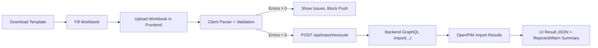

# Excel Import Guide

## 1. Purpose

This document is the implementation-level reference for the Excel-driven import pipeline used by the PIM Console.
It is intended for developers, QA, and data operators who need deterministic behavior and fast troubleshooting.

Scope:
- template structure and generation;
- frontend parsing and validation;
- backend execution contract;
- OpenPIM result interpretation;
- extension patterns for new product categories.

Primary implementation files:
- `/Users/romanshulgan/pim/pim-frontend/src/excelImportTemplate.js`
- `/Users/romanshulgan/pim/pim-frontend/src/excelImportParser.js`
- `/Users/romanshulgan/pim/pim-frontend/src/App.jsx`
- `/Users/romanshulgan/pim/pim-backend/src/main/java/org/example/pim/importer/ExcelImportController.java`
- `/Users/romanshulgan/pim/pim-backend/src/main/resources/graphql/import.graphqls`

---

## 2. End-to-End Flow



Behavior summary:
1. User downloads template from UI.
2. User fills metadata + product sheets.
3. Frontend parses workbook and validates cross-sheet consistency.
4. Push button is enabled only when no validation errors exist.
5. Backend forwards normalized payload to OpenPIM import mutation.
6. UI reports success, warnings, or row-level rejections.

---

## 3. Workbook Contract

## 3.1 Required Sheets

All sheets below are required.

Metadata sheets:
- `Import_Config`
- `Attribute_Groups`
- `Attributes`
- `Types`
- `Type_Group_Bindings`
- `Item_Parents`

Required product sheets:
- `TCT_Router_Bit`
- `Insert_Tool`
- `Countersink`

## 3.2 Why `Item_Parents` Is Mandatory

OpenPIM rejects child-type item creation under root when `parent_identifier` is not provided.
Typical rejection message:
- `Can not create item with such typeIdentifier under root`

The `Item_Parents` sheet provides a deterministic way to create parent items before product rows in the same import run.

---

## 4. Sheet-by-Sheet Specification

## 4.1 `Import_Config`

Headers:
- `key`
- `value`

Supported keys:
- `mode`: `CREATE_ONLY` | `UPDATE_ONLY` | `CREATE_UPDATE`
- `errors`: `PROCESS_WARN` | `WARN_REJECTED`
- `default_language`: language key for `LanguageDependentString` (example: `en`, `en-us`)

Defaults if omitted:
- `mode = CREATE_UPDATE`
- `errors = PROCESS_WARN`
- `default_language = en`

## 4.2 `Attribute_Groups`

Headers:
- `identifier` (required, unique)
- `name_en` (required)
- `order` (optional integer)
- `visible` (optional boolean)
- `options_json` (optional JSON object)

## 4.3 `Attributes`

Headers:
- `identifier` (required, unique)
- `name_en` (required)
- `type_code` (required integer in 1..8)
- `groups_csv` (required CSV of group identifiers)
- `order` (optional integer)
- `language_dependent` (optional boolean)
- `rich_text` (optional boolean)
- `multi_line` (optional boolean)
- `pattern` (optional string)
- `lov_identifier` (optional string)
- `options_json` (optional JSON object)
- `valid_types_csv` (optional CSV)
- `visible_types_csv` (optional CSV)

Type codes:
- `1=TEXT`
- `2=BOOLEAN`
- `3=INTEGER`
- `4=FLOAT`
- `5=DATE`
- `6=TIME`
- `7=ENUM`
- `8=URL`

## 4.4 `Types`

Headers:
- `identifier` (required, unique)
- `name_en` (required)
- `parent_identifier` (optional)
- `icon` (optional)
- `icon_color` (optional)
- `file` (optional boolean)

## 4.5 `Type_Group_Bindings`

Headers:
- `group_identifier` (required)
- `type_identifier` (required)
- `valid` (optional boolean, default `true`)
- `visible` (optional boolean, default `true`)

Purpose:
- expands attribute `valid` and `visible` type sets by group-level binding.

## 4.6 `Item_Parents`

Headers:
- `identifier` (required, unique across all item sheets)
- `name_en` (required)
- `type_identifier` (required)
- `parent_identifier` (optional)
- `values_json` (optional JSON object)
- `channels_json` (optional JSON object)

Import order guarantee:
- these rows are added before product sheets.

## 4.7 Product Sheets (`TCT_Router_Bit`, `Insert_Tool`, `Countersink`)

Required base headers:
- `identifier`
- `name_en`
- `type_identifier`
- `parent_identifier`
- `values_json`
- `channels_json`

Optional dynamic headers:
- any `attr:<attribute_identifier>` columns

Notes:
- base headers are required;
- dynamic `attr:*` headers are optional and can differ per product sheet.

---

## 5. Validation Rules (Frontend)

Validation is strict on data shape and references before request is sent.

## 5.1 Structural validation

Checks:
- required sheet exists;
- required headers exist;
- malformed JSON in `values_json` / `channels_json` / `options_json` is rejected.

## 5.2 Identifier validation

Checks:
- group/type/attribute identifiers must be present;
- duplicates rejected per entity type;
- item identifiers must be unique across all item sheets.

## 5.3 Cross-sheet validation

Checks:
- `Attributes.groups_csv` must reference known groups;
- `Type_Group_Bindings` references unknown groups/types -> warning;
- unknown attribute in item `values_json` or `attr:*` column -> error.

## 5.4 Type-parent rule for items

Rule:
- if an item row type is known in `Types` and that type has `parent_identifier`, then item row must provide `parent_identifier`.

Reason:
- avoids OpenPIM child-type-under-root rejection.

## 5.5 Value coercion by attribute type

Coercion behavior:
- boolean attribute (`type_code=2`): accepts `true/false/1/0/yes/no`;
- integer (`type_code=3`): strict integer parsing;
- float (`type_code=4`): numeric parsing;
- language-dependent attribute: scalar is wrapped as `{default_language: value}`;
- text-like types remain string.

---

## 6. Payload Mapping

Frontend emits backend payload:

```json
{
  "config": {"mode": "CREATE_UPDATE", "errors": "PROCESS_WARN"},
  "types": [...],
  "attrGroups": [...],
  "attributes": [...],
  "items": [...]
}
```

Item payload order:
1. rows from `Item_Parents`;
2. rows from `TCT_Router_Bit`;
3. rows from `Insert_Tool`;
4. rows from `Countersink`.

This order is intentionally stable and encoded in parser logic.

---

## 7. Backend Import Endpoint

Endpoint:
- `POST /api/import/execute`

Implementation:
- validates enum values and applies defaults;
- passes request as GraphQL variables to mutation `import(...)`;
- returns `{data, errors}`.

HTTP behavior:
- `200`: mutation executed (rows may still be `REJECTED`);
- `400`: controller-level bad request (invalid config enum);
- `502`: top-level GraphQL transport/execution failure.

---

## 8. UI Runtime Behavior

In `/Users/romanshulgan/pim/pim-frontend/src/App.jsx`:

1. file chosen -> parse + validate immediately;
2. status block shows pass/fail;
3. `Push Validated Data to PIM` button disabled when `importErrors.length > 0`;
4. import response shown as formatted JSON;
5. any row with `result=REJECTED` marks import status as error.

---

## 9. Developer Extension Guide

## 9.1 Add a new product sheet

1. add name to `PRODUCT_SHEETS` in `excelImportTemplate.js`;
2. add sheet generation block with sample row;
3. parser automatically includes it because parsing iterates over `PRODUCT_SHEETS`.

## 9.2 Add new metadata sheet type

1. add sheet constant and headers in `excelImportTemplate.js`;
2. implement parser function in `excelImportParser.js`;
3. add to required sheet list if mandatory;
4. map data into backend payload.

## 9.3 Add new import domain in backend

1. extend payload record in `ExcelImportController`;
2. add GraphQL variable and mutation argument;
3. extend selected return section in mutation selection set;
4. update frontend parser and status flattening.

---

## 10. Troubleshooting Matrix

| Symptom | Likely Cause | Fix |
| --- | --- | --- |
| `Sheet is required but missing` | user removed/renamed sheet | restore exact sheet name |
| `Missing required header` | edited header text | restore exact header spelling |
| `Invalid JSON object` | malformed JSON in `*_json` cell | fix JSON syntax |
| `Unknown attribute 'x'` | attribute not defined in metadata | define it in `Attributes` or fix typo |
| `type 'x' is child of 'y', so parent_identifier is required` | missing parent for child type item | create parent in `Item_Parents` and reference it |
| row `REJECTED` with code 6 | OpenPIM child type imported under root | provide parent hierarchy as above |

---

## 11. Suggested Validation/QA Commands

```bash
# Frontend static checks
cd /Users/romanshulgan/pim/pim-frontend
npm run lint
npm run build

# Backend package check
cd /Users/romanshulgan/pim/pim-backend
mvn -DskipTests package

# End-to-end stack
cd /Users/romanshulgan/pim
docker compose up -d --build

# Import endpoint smoke
curl -sS -X POST http://localhost:8080/api/import/execute \
  -H 'Content-Type: application/json' \
  -d '{"config":{"mode":"CREATE_UPDATE","errors":"PROCESS_WARN"},"types":[],"attrGroups":[],"attributes":[],"items":[]}'
```

